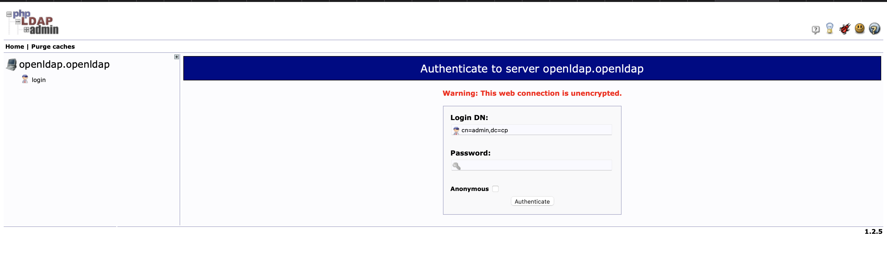

# Catalog of Operators and Instances Catalog for One Touch Provisioning asset

This git repository serves as a catalog/library of Operators and Instances of the custom resource(s) provided by the Operators for the [One Touch Provisioning](https://github.com/one-touch-provisioning/otp-gitops) asset.  The Operator and Instance YAMLs are package as a Helm Chart and can be referenced by ArgoCD Applications.

The Charts are hosted in the [Cloud Native Toolkit Helm Repository](https://github.com/cloud-native-toolkit/toolkit-charts).

## Instances

Instances are deployed with mostly default options selected. You will need to modify these to suit your configurations.

### Instana

The prerequisites to install the Instana agent are:  

1. Store your Instana Agent Key in a secret in the `instana-agent` namespace. The secret key field should contain `key` and the value contains your Instana Agent Key. Modify the `instana-agent.agent.keysSecret` value in the `instances\instana-agent\values.yaml` file to match the secret you deployed. 

2. Modify the `instana-agent.cluster.name` value in the `instances\instana-agent\values.yaml` file which represents the name that will be assigned to this cluster in Instana.

3. Modify the `instana-agent.zone.name` value in the `instances\instana-agent\values.yaml` file which is the custom zone that detected technologies will be assigned to.

## CP4BA - FileNet and IER assets

The assets deployed are defined in the [kustomization](https://github.com/oto-gitops-oneshot/otp-gitops/blob/master/0-bootstrap/hub/2-services/kustomization.yaml) file found in the [services](https://github.com/oto-gitops-oneshot/otp-gitops/tree/master/0-bootstrap/hub/2-services) directory in the [parent repository](https://github.com/oto-gitops-oneshot/otp-gitops). The file is laid out in a manner to make it clear what components are relevant for this use case.

First and foremost, we do plan to extend this framework to support other Cloud Paks as well. The "CloudPaks" heading should make this apparent, therein lies the different cloud paks, for instance CP4I and CP4BA.

Scroll down a tad and divert your attention to the CP4BA heading, along with the list of the enclosed services, as shown below.

The applications are stood in a particular order, as dictated by [ArgoCD Sync Waves](). This sequence is, more or less, given in descending order. For instance, note the operators are deployed first, followed by the required ancillary services  (DB2 and LDAP in our case), followed by the pre-deployment, deploymant and post-deployment applications of the CP4BA Asset.

### CP4BA - Operators

The CP4BA CatalogSources and Subscription objects, as referenced by the kustomization file given in the section above are found in the [cp4ba operator](https://github.com/oto-gitops-oneshot/otp-gitops-services/tree/master/operators/cloudpak/cp4ba-operator) directory of this repository. Therein lies the CatalogSources and Subscription objects, each allocated to it's corresponding sub-directory. We use the [Kustomize framework](https://kustomize.io) to standardise the method around which updates are to be performed upon the subscription channels and catalogSources, in the event future versions of this asset are exposed to the public for consumption. As an example, consider the [catalogsource](https://github.com/oto-gitops-oneshot/otp-gitops-services/blob/master/operators/cloudpak/cp4ba-operator/catalog-sources/base/catalogsource.yaml) file found in the catalog source [base](https://github.com/oto-gitops-oneshot/otp-gitops-services/tree/master/operators/cloudpak/cp4ba-operator/catalog-sources/base) directory. The image field of each CatalogSource object within contains a reference to the location of the actual image in the icr repository. These references are defined in the [kustomization](https://github.com/oto-gitops-oneshot/otp-gitops-services/blob/master/operators/cloudpak/cp4ba-operator/catalog-sources/overlays/latest/kustomization.yaml) file located in the catalog source [overlays](https://github.com/oto-gitops-oneshot/otp-gitops-services/tree/master/operators/cloudpak/cp4ba-operator/catalog-sources/overlays/latest) directory. Simply update the values found in this file in accordance to the requirements laid out in future versions.

For instance, assuming a new version of "ibm-cp4a-operator-catalog" was released. The highlighted line below would be updated:

Which would, in turn, update the highlighted line in the base catalog source object, once Kustomize is triggered to build of course:

Better yet, an entirely new sub-directory can be created in the overlays directory, aptly named the version number (or id) as opposed to latest (which is 22.0.1 as of the time of writing). This renders it more maintainable, and allows easy rollbacks if necessary.

On a similar note, maintainers would simply update this [kustomization](https://github.com/oto-gitops-oneshot/otp-gitops-services/blob/master/operators/cloudpak/cp4ba-operator/subscription/overlays/latest/kustomization.yaml) file found in the [subscription overlays](https://github.com/oto-gitops-oneshot/otp-gitops-services/tree/master/operators/cloudpak/cp4ba-operator/subscription/overlays/latest) directory to update the subscription channel, which would override the spec.channel field present in the [subscription](https://github.com/oto-gitops-oneshot/otp-gitops-services/blob/master/operators/cloudpak/cp4ba-operator/subscription/base/subscription.yaml) file located in the [base](https://github.com/oto-gitops-oneshot/otp-gitops-services/tree/master/operators/cloudpak/cp4ba-operator/subscription/base) directory.

As of the time of writing, we are using the latest stable version of CP4BA - that is, 22.0.1. The aformentioned YAML's were obtained from the official documentation:

1) [Case Package](https://www.ibm.com/docs/en/cloud-paks/cp-biz-automation/22.0.1?topic=ppd-preparing-client-connect-cluster)
2) [Procedure](https://www.ibm.com/docs/en/cloud-paks/cp-biz-automation/22.0.1?topic=ppd-setting-up-cluster-in-openshift-console)

Note the links given above point to the latest stable version currently supported at the time of writing. Newer versions/links will likely be available, depending on the delta on when you read this and when the last update to this page was made.

In either case, the case package link contains the YAML files, and the procedure link explains how they are used. We simply adapted to fit within the confines of this framework.

### DB2 - Operators

The contents of the previous section also apply here. Again, please note we are using the latest stable version of the DB2 operator which, at the time of writing, is version 11.5.0.

The following [link](https://www.ibm.com/docs/en/db2/11.5?topic=SSEPGG_11.5.0/com.ibm.db2.luw.db2u_openshift.doc/doc/t_db2u_install_op_catalog.html) contains the CatalogSource specification. The Subscription is not given in the link. We "reverse-engineered" it by deploying the operator manually via the OpenShift UI and retrieving the Subscription object created as a consequence.

### DB2 - Instance

The relevant objects defining the DB2 deployment assets are housed in the [db2](https://github.com/oto-gitops-oneshot/otp-gitops-services/tree/master/instances/db2/create) directory. We use, again, the kustomize framework to tailor each deployment given the deployment platform. The DB2UCluster custom resource requires a storageClassName field, which is a function of the target hyperscaler. We have tested this against ROKS, hence the presence of the [ibmcloud-roks](https://github.com/oto-gitops-oneshot/otp-gitops-services/tree/master/instances/db2/create/overlays/ibmcloud-roks) directory. The [DB2UCluster](https://github.com/oto-gitops-oneshot/otp-gitops-services/blob/master/instances/db2/create/overlays/ibmcloud-roks/db2ucluster.yaml) object within overrides both the version and the storageClassName accordingly. Perhaps the changes should have split across multiple files, as opposed to one to make it clear what each file is responsible for. Future work would entail structuring this in a more cohesive manner as described earlier, in addition to testing deployments to other platforms, namely AWS and Azure.

You may recall the pull secret required to pull the image is defined in the [pull-secret](https://github.com/oto-gitops-oneshot/otp-gitops-services/blob/master/instances/db2/create/base/pull-secret.yaml) file in the db2 [base](https://github.com/oto-gitops-oneshot/otp-gitops-services/tree/master/instances/db2/create/base) directory. Populating this constituted part of the pre-requisite steps as outlined [here](https://github.com/oto-gitops-oneshot#prerequisite---secret-creation).

In either case, maintainers simply need to update the spec.version in the [DB2UCluster](https://github.com/oto-gitops-oneshot/otp-gitops-services/blob/master/instances/db2/create/overlays/ibmcloud-roks/db2ucluster.yaml) file found in the corresponding [ibmcloud-roks](https://github.com/oto-gitops-oneshot/otp-gitops-services/tree/master/instances/db2/create/overlays/ibmcloud-roks) directory in the event of new updates, provided the relevant changes are made upstream in the [operators db2](https://github.com/oto-gitops-oneshot/otp-gitops-services/tree/master/operators/db2) directory of course.

### Openldap - Instance

This is not an operator based deployment, as opposed to DB2. All objects are defined as a Helm Chart located in the openldap [instance](https://github.com/oto-gitops-oneshot/otp-gitops-services/tree/master/instances/openldap) directory. This Helm chart is quite involved containing a multitude of interrelated components. As such, only the relevant components are outlined here.

The [values](https://github.com/oto-gitops-oneshot/otp-gitops-services/blob/master/instances/openldap/values.yaml) file found within the [openldap](https://github.com/oto-gitops-oneshot/otp-gitops-services/tree/master/instances/openldap) directory contains an "existingSecret" field, as seen in line 61. If the value associated with this field is empty, the passwords defined in lines 19 and 20 are used instead. If the value is non empty (as in our case), a pre-existing secret, given by the assigned value, is used instead. Note the name assigned is "openldap". This name coincides with the pre-existing secret defined in the [external-admin-secret](https://github.com/oto-gitops-oneshot/otp-gitops-services/blob/master/instances/openldap/templates/external-admin-secret.yaml) file. Note the Helm conditional located up the top as given below. This secret is only instantiated in the event the existingSecret field in the aforementioned values file is non empty.

Populating the secret defined in [external-admin-secret](https://github.com/oto-gitops-oneshot/otp-gitops-services/blob/master/instances/openldap/templates/external-admin-secret.yaml) constituted part of the pre-requisite steps as outlined [here](https://github.com/oto-gitops-oneshot#prerequisite---secret-creation).

The "adminPassword" portion of this secret defines the LDAP Adminstrator password required to login, as shown below. The URL exposing this service is defined in the [edgeroute](https://github.com/oto-gitops-oneshot/otp-gitops-services/blob/master/instances/openldap/templates/edgeroute.yaml) file located in the outer [templates](https://github.com/oto-gitops-oneshot/otp-gitops-services/tree/master/instances/openldap/templates) directory. Put simply, it is a route exposed in the **openldap** namespace. The username is prepopulated, and should be left intact.

A successful login renders the users and groups constituting this active directory. These entities are defined in the "customLdifFiles" stanza of the [values](https://github.com/oto-gitops-oneshot/otp-gitops-services/blob/master/instances/openldap/values.yaml). The users defined are ultimately federated as CP4BA users.

In a production setting, the customer's active directory server would most likely be used, as opposed to this custom LDAP deployment.

### CP4BA - Predeployment Applications

As per the name implies, a number of steps need to be performed prior to the deployment of the CP4BA custom resource. These steps are contained within scripts encapsulated inside docker containers running as K8's jobs. The highlighted entries shown below map to predefined K8's jobs triggered to run at the appropriate time during the provisioning process.

The following README's, found in the relevant directories within the job repository, provide a deeper insight into the automation carried by each job:

1) [db2-configuration](https://github.com/oto-gitops-oneshot/cp4ba-config-jobs/tree/main/db2#db2-configuration-job)
2) [dbs-cp4ba-configuration](https://github.com/oto-gitops-oneshot/cp4ba-config-jobs/tree/main/dbs)
3) [global-ca](https://github.com/oto-gitops-oneshot/cp4ba-config-jobs/tree/main/predeploy-cert-config)

The last highlighted entry in the figure above creates the secret required by and each every deployed service of this asset. The steps required to carry this out should have already been completed as outlined [here].(https://github.com/oto-gitops-oneshot#prerequisite---secret-creation)

### CP4BA - Deployment

This is the meat and bones of the application, deployment is triggered following successful completion of the pre deployment tasks mentioned above. This is fully contained as a YAML specification describing the required state of the deployment, and is found in the [deploy](https://github.com/oto-gitops-oneshot/otp-gitops-services/tree/master/instances/cloudpak/cp4ba/deploy) directory. The base custom resource is defined in the [custom-resource](https://github.com/oto-gitops-oneshot/otp-gitops-services/blob/master/instances/cloudpak/cp4ba/deploy/base/cr.yaml) file located in its corresponding [base](https://github.com/oto-gitops-oneshot/otp-gitops-services/tree/master/instances/cloudpak/cp4ba/deploy/base) sub-directory. This base file is quite minimal, and for good reason, as explained shortly. The yaml's describing the different components constituting the cloud pak are defined in its corresponding [overlays](https://github.com/oto-gitops-oneshot/otp-gitops-services/tree/master/instances/cloudpak/cp4ba/deploy/overlays/ibmcloud-roks) directory. For instance, the following components, amongst others, are defined as yaml's:

1) GraphQL
2) CPE
3) CSS
4) TM

We provide a framework whereby the components an operator wishes to deploy can be easily "toggled" on and off simply by commenting and uncommenting the entries found in the [kustomization](https://github.com/oto-gitops-oneshot/otp-gitops-services/blob/master/instances/cloudpak/cp4ba/deploy/overlays/ibmcloud-roks/kustomization.yaml) file found in the aforementioned overlays sub-directory. For instance, if an operator wishes to deploy all components, the YAML would be as such:

In the event BAN and CPE were not required, the corresponding entries are simply commented out:

At the time of writing, not all components are supported. Inclusion of the other components constituting this CloudPak is the eventual end state. That said, the procedure is quite straightforward. Describe the YAML spec for that component, and add the entry to the kustomization file.

### CP4BA - Postdeployment Application

As per the name, a number of steps need to be performed following the deployment of the CP4BA custom resource. These steps are contained within scripts encapsulated inside docker containers running as K8's jobs. The highlighted entry shown below effectively maps to a predefined K8's job triggered to run at the appropriate time during the provisioning process.

This [README](https://github.com/oto-gitops-oneshot/cp4ba-config-jobs/tree/main/postdeploy-config) offers a deeper insight into the automation carried out by the post deployment job.